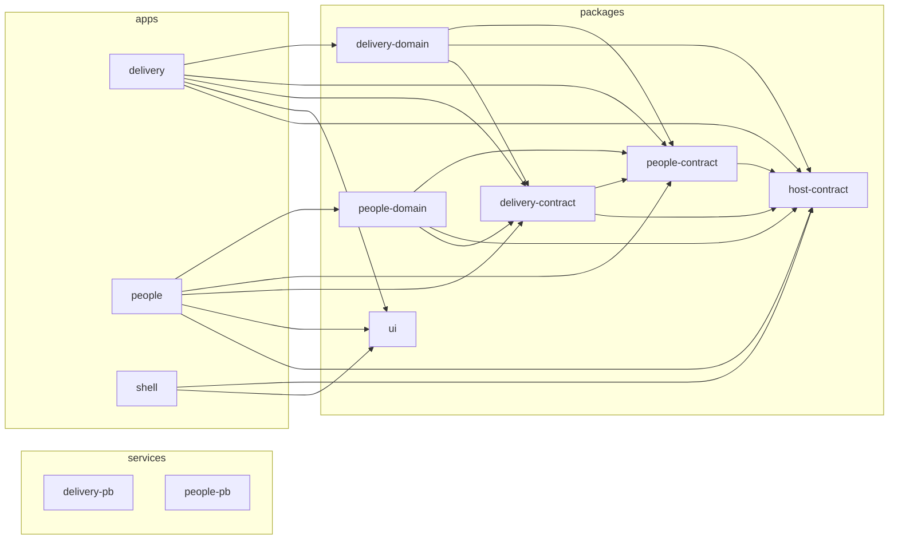

# Baseline

Baseline answers one question for a delivery organisation: **who is working on what, for how long, and what it costs.** It is three Module Federation builds owned by two teams and a platform:

| App          | Owner    | What it does                                                                                 |
| ------------ | -------- | -------------------------------------------------------------------------------------------- |
| **shell**    | Platform | Hosts both remotes; owns navigation, the display currency and the active user                |
| **people**   | People   | Employee register, weekly hours, cost-rate history (add, correct, remove, retroactively too) |
| **delivery** | Delivery | Work breakdown tree and a month-by-month staffing grid in hours, person-months, % or cost    |

The teams never import each other's source. They meet at runtime (Module Federation, one React singleton) and through versioned contract packages, and each team runs its own data service.

The brief is in [.docs/taks.md](.docs/taks.md), the plan in [.docs/plan.md](.docs/plan.md) and the decisions in [.docs/adr/](.docs/adr/).

## Contents

1. [Run it](#run-it)
2. [Break a remote on purpose](#break-a-remote-on-purpose)
3. [Reset the data](#reset-the-data)
4. [Tests](#tests)
5. [Repository map](#repository-map)
6. [Architecture](#architecture)
7. [Delivery pricing: why Delivery computes cost itself](#delivery-pricing-why-delivery-computes-cost-itself)
8. [Decision summary](#decision-summary)
9. [Known limitations and open choices](#known-limitations-and-open-choices)

## Run it

You need Docker with Compose v2. No Node on the host: every app is built inside a `node:24` image.

```bash
docker compose up
```

The first run builds five images and takes a few minutes. Then open:

| URL                                     | What                                                           |
| --------------------------------------- | -------------------------------------------------------------- |
| http://localhost:8080                   | The shell, with People and Delivery hosted (`/` → `/people`)   |
| http://localhost:8080/people/emp-001    | A. Okafor in People                                            |
| http://localhost:8080/delivery/prj-1    | Project 1's staffing grid; March 2026 holds the reference cell |
| http://localhost:8080/remotes/people/   | People standalone, from the same build                         |
| http://localhost:8080/remotes/delivery/ | Delivery standalone, from the same build                       |

`docker compose up -d --build --wait` (or `pnpm start`, if you have pnpm) starts it in the background and returns when every container is healthy. `docker compose down` (`pnpm stop`) stops it and keeps the data.

**Things to try.** Switch Delivery to **Cost**, click a cell and read the cell details panel under the grid: for Okafor in March 2026 it shows `0.50 PM = 88.00 h = 50.0% of capacity = €7,880.00`, 22 working days split 8 / 14, and `€89.5455/h`. Change Okafor's rate in People in a second tab, and the grid reprices with no reload. Switch the currency in the top bar, and both remotes follow.

**Developing with hot reload** (needs Node 24 and pnpm through Corepack, see `.nvmrc`):

```bash
corepack enable
pnpm install
pnpm start:dev   # PocketBase and the gateway in Docker, the three Rsbuild dev servers on the host
```

The shell runs at http://localhost:3000 and loads the remotes from their dev servers on :3010 and :3020 (`apps/shell/public/config.json`). Each dev server proxies `/api` to the gateway on :8080, so dev uses the same PocketBase as Docker.

**Runtime configuration.** The shell container writes `/config.json` at start from its environment, so remote URLs never come from the bundle. All variables are optional:

| Variable              | Default                                |
| --------------------- | -------------------------------------- |
| `PEOPLE_REMOTE_URL`   | `/remotes/people/remoteEntry.js`       |
| `DELIVERY_REMOTE_URL` | `/remotes/delivery/remoteEntry.js`     |
| `FX_TABLE`            | `EUR=1,USD=1.08,GBP=0.85` (per 1 EUR)  |
| `DEFAULT_CURRENCY`    | `EUR`                                  |
| `USERS`               | `user-1=Demo Planner,user-2=Demo Lead` |

A malformed value stops the shell container with a message at `docker compose up`, rather than as a blank page.

## Break a remote on purpose

Each method leaves the gateway, the shell and the other remote running. The broken panel shows an in-place message with **Try again**, the nav and the other panel keep working, and the status strip at the bottom shows each remote's state and the `remoteEntry.js` URL it was loaded from.

| How                          | Break                                                                                                                                                                                         | Undo                                              |
| ---------------------------- | --------------------------------------------------------------------------------------------------------------------------------------------------------------------------------------------- | ------------------------------------------------- |
| **In the browser**           | http://localhost:8080/people?break=people (or `?break=delivery`, or both: `?break=people,delivery`). The shell swaps that remote's URL for one that doesn't exist; no infrastructure involved | Drop the query parameter                          |
| **Stop the container**       | `docker compose stop people` (or `delivery`). The gateway answers `502` for `/remotes/people/…`                                                                                               | `docker compose start people`, then **Try again** |
| **Bad remote URL in config** | `PEOPLE_REMOTE_URL=/remotes/people/nope.js docker compose up -d shell`. The shell is recreated with a `config.json` that points at a `404`                                                    | `docker compose up -d shell`                      |

**Breaking a data service** instead of a remote shows the degraded states (D32):

- `docker compose stop delivery-pb`: People keeps working and shows **Capacity unknown** where the over-capacity badges were.
- `docker compose stop people-pb`: Delivery keeps its own data. Opened fresh, the grid says People's data can't be reached, shows employee ids instead of names, disables Hours and Cost, and keeps PM and % editable. Both clear by themselves when the service is started again and realtime reconnects.

Details and the edge cases (URLs without an extension, dead hosts) are in [ADR 031](.docs/adr/031-infra-and-break-methods.md).

## Reset the data

Each PocketBase instance seeds itself from [.docs/data.json](.docs/data.json) on its first start against an empty volume, and edits survive reloads and restarts. Two ways back to the seed:

- `docker compose down -v`, then `docker compose up`: removes the containers and both data volumes (`pnpm stop:clean`).
- `infra/scripts/reset.sh`: keeps the gateway and the apps running, empties only the two data volumes, and returns when both services are healthy and seeded again.

## Tests

The tests run on the host (Node 24, `pnpm install` first):

```bash
pnpm test              # every unit, property and component test
pnpm test:coverage     # the same with coverage (istanbul)
pnpm lint              # Rslint (type-aware), Prettier, dependency-cruiser boundary rules
pnpm typecheck         # tsc --noEmit for the root and every package
infra/scripts/reset.sh && pnpm test:integration   # against the running compose stack, through the gateway
```

The weight is on calculation logic that runs without React. `pnpm test` runs these Rstest projects:

| Project        | Environment | What it covers                                                                                                                                                                                                                                                                                                                                             |
| -------------- | ----------- | ---------------------------------------------------------------------------------------------------------------------------------------------------------------------------------------------------------------------------------------------------------------------------------------------------------------------------------------------------------- |
| `domain`       | Node        | `delivery-domain`, `people-domain`, the contracts and each app's `shared/api` adapter. Includes the reference calculation ([reference.test.ts](packages/delivery-domain/src/reference.test.ts)), fast-check property tests (unit round-trips, `roundGrid` on random trees with ±10% stress values, the capacity causer, rate slicing) and type-level tests |
| `services`     | Node        | The PocketBase hook logic in `services/*/pb_hooks/lib`, including a property test that `load.js` agrees with `delivery-domain`'s capacity rule                                                                                                                                                                                                             |
| `tooling`      | Node        | `.dependency-cruiser.test.ts`: every boundary rule is shown to fail on a forbidden import                                                                                                                                                                                                                                                                  |
| `components-*` | jsdom       | Component tests for the shell, People, Delivery and `ui`, through each app's own Rsbuild config and an in-memory fake repository (no HTTP mocking)                                                                                                                                                                                                         |

`pnpm test:integration` checks PocketBase itself: seed counts, a unique-index clash, a failing batch leaving nothing behind, D9's atomic re-pointing, realtime delivery, and `editedAt` and the capacity causer. Cross-app behaviour (live rate propagation, capacity flags across apps, currency, outages, the cross-app link) was verified by hand on the composed stack; there are no browser E2E tests (plan T8.1, out of scope).

## Repository map

```text
apps/                      three Module Federation builds, each laid out by Feature-Sliced Design:
                           src/app, pages, widgets, features, entities, shared (ADR 038)
  shell/                   host: top bar (nav, currency, user), runtime remote loader, panel error
                           boundaries with retry, status strip, first-segment routing
  people/                  remote: register with search, employee page, rate history editor, capacity badge
  delivery/                remote: project list, WBS tree, staffing grid, cell details panel
packages/                  workspace packages, compiled from TypeScript source by each app (no builds)
  host-contract/           platform: HostContext, RemoteModule, Currency, ActiveUser, IsoDate, Month
  people-contract/         People v1: Employee, RateRecord, collection names, effective-dating rule,
                           conformance fixture
  delivery-contract/       Delivery v1: EmployeeMonthLoad (the published capacity feed), ids, entities
  people-domain/           pure TS: rate-history rules, search, capacity summary, money, parseAmount
  delivery-domain/         pure TS: calendar, rate slices, pricing, units, roundGrid, roll-up, capacity,
                           tree operations, the grid view model, parseAmount, formatting
  ui/                      platform: presentational primitives on native elements, tokens.css
services/
  people-pb/               People's PocketBase: pb_migrations (schema, rules, seed), tests
  delivery-pb/             Delivery's PocketBase: pb_migrations, pb_hooks (editedAt, capacity load), tests
infra/
  docker/                  app Dockerfiles, one PocketBase image, entrypoints (config.json, <base href>)
  nginx/                   gateway.conf (routing only), app.conf (each app's SPA fallback)
  scripts/reset.sh         reset both data services to the seed
docker-compose.yml         gateway, shell, people, delivery, people-pb, delivery-pb
.dependency-cruiser.cjs    boundary and FSD rules (and its test, .dependency-cruiser.test.ts)
rslint.config.ts           type-aware lint rules
rstest*.config.ts          test projects (unit, component, integration)
.docs/                     the brief, plan, screen mockups, seed data and ADRs 001–049
```

## Architecture

```text
browser ── localhost:8080 ── gateway (nginx, the only published port)
                               ├── /                    → shell        static; /config.json written at container start
                               ├── /remotes/people/     → people       static: remoteEntry.js + standalone index.html
                               ├── /remotes/delivery/   → delivery     static: remoteEntry.js + standalone index.html
                               ├── /api/people/*        → people-pb    PocketBase: employees, rate_records
                               └── /api/delivery/*      → delivery-pb  PocketBase: projects, breakdown_items,
                                                                       allocations, employee_month_loads
```

**Module Federation** (Rsbuild/Rspack with `@module-federation/rsbuild-plugin`). The shell has no remotes in its build: at boot it reads `/config.json` and registers them with the MF runtime API. Each remote exposes `./App` and `./mount` and resolves its own chunks relative to its `remoteEntry.js` (`assetPrefix: 'auto'`), so a remote can be served from any path. `react` and `react-dom` are shared singletons; the status strip shows the React version and an identity check across the three apps. Each remote's `index.html` boots `mount()` with a standalone `HostContext`, so one build serves both modes. Every panel sits behind `Suspense`, an error boundary and a load timeout.

**Ownership and contracts.**

| Owner    | Owns                                                     | Publishes                                                                                                                                        | Reads                        |
| -------- | -------------------------------------------------------- | ------------------------------------------------------------------------------------------------------------------------------------------------ | ---------------------------- |
| Platform | navigation, currency, active user, remote config, `ui`   | `host-contract`: `HostContext { currency, activeUser, basePath, navigate }`, the `mount` signature                                               | —                            |
| People   | employees, rate records                                  | `people-contract` v1: the `employees` and `rate_records` collections and their realtime topics, the effective-dating rule, a conformance fixture | Delivery's load feed         |
| Delivery | projects, breakdown tree, allocations, calendar, pricing | `delivery-contract` v1: the `employee_month_loads` collection (per person and month: PM, `overCapacity`, the causing allocation)                 | People's employees and rates |

Contract packages hold only types, zod schemas, constants and fixtures, never behaviour. Every record and realtime event is parsed with them at the boundary. Delivery's allocations stay private: People sees only the load feed.

**Data and transport.** Each team runs a stock PocketBase in its own container with its own volume, configured only by its migrations and a few hooks ([ADR 032](.docs/adr/032-pocketbase-data-layer.md)). The schema enforces shapes, bounds, unique indexes and relations; the domain rules (tree depth, cycles, rate history) run in the team's app through its domain package before a write. Every write is one batch request, so a change set commits or rolls back as a whole. A change reaches the other remote through PocketBase realtime (SSE): each app subscribes to the collections it reads, patches its TanStack Query cache by id, and refetches after a reconnect. That works hosted, standalone and across tabs, and no remote needs the other remote's JavaScript to be loaded.

**Dependency graph**, generated by dependency-cruiser at package level (`pnpm graph`; tests excluded). People and Delivery reach each other only through the contract packages, the shell uses only the platform packages, and the services import nothing:



`pnpm lint:deps` enforces it on every run: no app imports another app, no team imports the other team's app, domain or service, contracts import only zod and other contracts, domain packages import no React, `ui` imports only React and `clsx`, no cycles, and inside each app the Feature-Sliced Design layers import only downwards, slices don't import each other, and other code reaches a slice only through its `index.ts`.

**Shared UI.** `packages/ui` is a workspace dependency that each app compiles into its own bundle, not an MF share. A shell release can't push a breaking UI change into a running remote, and standalone needs nothing from the shell. Each app prefixes its CSS Module class names (`bl-people-…`), so two copies of `ui` at different versions can't clash on one page. In a multi-repo setup `ui` would be a semver-published package each team upgrades on its own schedule. Everything is hand-written on native elements: no component kit, headless primitives, table, grid or tree package. react-hook-form manages form state but renders nothing.

## Delivery pricing: why Delivery computes cost itself

The brief asks whether Delivery should (1) read People's rate records and compute cost itself, or (2) ask People for a computed cost. **Baseline does (1)** ([ADR 007](.docs/adr/007-delivery-pricing.md)).

**Pricing a plan is Delivery's job, not People's.** People owns a fact: what a person costs per hour from which date. Turning that into the cost of a plan needs things only Delivery has: allocations in person-months, the project's months, the working-day calendar, the person-month definition, the four display units and the rounding of a whole grid. Under option 2 People would need all of those, or Delivery would have to send them over, so People's contract would grow with every Delivery feature: a new unit, a holiday rule, the partial-month policy. Under option 1 People's contract is three fields (`employeeId`, `validFrom`, `hourlyCost`) and one rule, and it stays stable when Delivery changes.

**The grid needs cost locally and synchronously.** A project grid holds hundreds of cells (720 allocations across four projects), and every number in it depends on every other through the totals:

- **Rounding is joint.** `roundGrid` chooses each cell's rounding direction together with every parent and row total, so that totals add up in both directions and every displayed number is within one step of its exact value. It needs the _exact_ cost of every cell at once. Per-cell costs from a remote call, already rounded or arriving one by one, couldn't give that.
- **€ edits need the rate as you type.** Typing `7,880` in a cost cell has to become person-months: EUR ÷ blended rate ÷ hours per PM. The blended rate is a weighted average over rate slices that depends on the month and the person, so with option 2 every € keystroke would be a round trip, or People would have to publish the inverse as well.
- **Unit and currency switches are free.** Switching to Cost, or from EUR to GBP, recomputes from data already in memory. With option 2 each switch would refetch, or Delivery would cache People's answers and run into invalidation.

**It behaves better when things fail.** Delivery never needs People's _remote_ (its JavaScript) to be loaded; it reads People's published data service directly. When `people-pb` goes down mid-session, Delivery keeps pricing from the rates already in its cache. Only a fresh load with no People data falls back to PM and %, which need no rates. Under option 2 a People outage would blank every cost cell at once, and a slow People would slow every Delivery edit.

**Live updates stay simple.** A rate edit in People is a write to `rate_records`, and PocketBase pushes the record to every subscriber. Delivery patches its cache and reprices only that person's cells, with no request back to People and no "cost changed" event for People to work out and emit.

**It is testable where the brief looks hardest.** All of pricing is pure TypeScript in `delivery-domain` (calendar, rate slices, blended rate, cost, the € inverse, rounding), tested without React, including the reference calculation and property tests.

**What it costs, and how that is handled.**

- **Two teams must agree on the effective-dating rule** (inclusive `validFrom`, the last rate open-ended, days before the first rate unpriced). That is semantic coupling. People publishes the rule in prose in `people-contract`, plus a conformance fixture: Okafor's two rate records and the March 2026 slices any reader must compute from them (8 days at €80, 14 at €95). Delivery's rate tests run against the fixture, so if either side changes its reading, a test fails.
- **Delivery sees raw hourly rates.** In a real organisation rates can be confidential, and then option 2 (or an aggregated cost feed) would be the right call. The brief doesn't make rates confidential, and Delivery has to show the blended rate anyway.
- **People can't change how cost is computed** without Delivery shipping too. That's right for this split: how a plan is priced is a Delivery decision.

**When option 2 would win:** confidential rates, pricing rules that belong to People (overtime, contract types, cost-centre loadings), or many consumers that must show identical costs. None of these hold here.

## Decision summary

Every decision has an ADR in [.docs/adr/](.docs/adr/); plan §2 has the alternatives and costs in one table.

| #   | Decision                  | Choice                                                                                                                                                     | ADR                                                                                                       |
| --- | ------------------------- | ---------------------------------------------------------------------------------------------------------------------------------------------------------- | --------------------------------------------------------------------------------------------------------- |
| D1  | Bundler and MF            | Rsbuild/Rspack with `@module-federation/rsbuild-plugin` and the MF 2.0 runtime API                                                                         | [001](.docs/adr/001-bundler-and-module-federation.md), [030](.docs/adr/030-module-federation-skeleton.md) |
| D2  | Monorepo                  | pnpm workspaces: `apps/*`, `packages/*`, `services/*`                                                                                                      | [002](.docs/adr/002-monorepo.md)                                                                          |
| D3  | Canonical unit            | Person-months, unrounded. Hours, % and cost are pure functions of PM, the employee, the month and the rates                                                | [003](.docs/adr/003-canonical-allocation-unit.md)                                                         |
| D4  | Data layer                | One stock PocketBase per team; the schema enforces what it can, the domain packages the rest                                                               | [032](.docs/adr/032-pocketbase-data-layer.md)                                                             |
| D5  | Persistence               | PocketBase's SQLite on one volume per team; a change set is one batch request (one transaction)                                                            | [032](.docs/adr/032-pocketbase-data-layer.md)                                                             |
| D6  | Transport between remotes | PocketBase realtime (SSE) plus REST reads; consumers patch by id and refetch after a reconnect                                                             | [032](.docs/adr/032-pocketbase-data-layer.md)                                                             |
| D7  | **Delivery pricing**      | **Delivery reads rate records and computes cost itself** (above)                                                                                           | [007](.docs/adr/007-delivery-pricing.md)                                                                  |
| D8  | Capacity flow             | `delivery-pb` publishes `employee_month_loads`, kept in step by a hook in the allocation write's transaction; a property test ties it to `delivery-domain` | [032](.docs/adr/032-pocketbase-data-layer.md), [035](.docs/adr/035-delivery-pb.md)                        |
| D9  | Leaf gains a child        | Its allocations move to the new child, atomically, and the user is told                                                                                    | [009](.docs/adr/009-leaf-gains-a-child.md)                                                                |
| D10 | Remote interface          | `./App` (a component taking `HostContext`) and `./mount(el, ctx) → { update, unmount }`                                                                    | [010](.docs/adr/010-remote-interface.md)                                                                  |
| D11 | Display currency          | Rates stored in EUR; the shell owns `{ code, perEur }` from runtime config; € input converts back before use                                               | [011](.docs/adr/011-display-currency.md)                                                                  |
| D12 | Shared UI                 | `packages/ui`, bundled by each app, not shared through MF                                                                                                  | [012](.docs/adr/012-shared-ui-primitives.md)                                                              |
| D13 | Styling                   | CSS Modules with typed class names, `clsx`, tokens as CSS custom properties                                                                                | [013](.docs/adr/013-styling.md)                                                                           |
| D14 | Test stack                | Rstest, fast-check, expect-type, Testing Library in jsdom                                                                                                  | [014](.docs/adr/014-test-stack.md)                                                                        |
| D15 | Move across projects      | Forbidden                                                                                                                                                  | [015](.docs/adr/015-moving-wbs-across-projects.md)                                                        |
| D16 | Deleting an employee      | Forbidden (locked API rules, no UI action)                                                                                                                 | [016](.docs/adr/016-deleting-an-employee.md)                                                              |
| D17 | Partially unpriced month  | Days before the first rate cost 0; € edits refused in that month, in one function                                                                          | [017](.docs/adr/017-partially-unpriced-month.md)                                                          |
| D18 | "Most recently edited"    | `editedAt` stamped by the server on effort edits; latest wins, ties by highest id                                                                          | [018](.docs/adr/018-most-recently-edited.md)                                                              |
| D19 | Rounding                  | Controlled rounding of the whole grid as a min-cost flow: largest remainder in both directions                                                             | [019](.docs/adr/019-rounding-scheme.md), [027](.docs/adr/027-round-grid-network.md)                       |
| D20 | Dates                     | `date-fns` v4 in UTC, confined to the calendar module                                                                                                      | [020](.docs/adr/020-date-library.md)                                                                      |
| D21 | Schemas                   | zod v4, one version through a pnpm catalog, a peer dependency of the contracts                                                                             | [021](.docs/adr/021-schema-validation.md)                                                                 |
| D22 | Routing                   | React Router v7, one router per app, not shared; cross-app links through `HostContext.navigate`                                                            | [022](.docs/adr/022-routing.md)                                                                           |
| D23 | Boundaries                | dependency-cruiser over the whole import graph                                                                                                             | [023](.docs/adr/023-boundary-enforcement.md)                                                              |
| D24 | Linter                    | Rslint, type-aware, built-in plugins only; Prettier formats                                                                                                | [024](.docs/adr/024-code-linter.md)                                                                       |
| D25 | Service build             | None: one platform PocketBase image loads each team's plain-JS migrations and hooks                                                                        | [032](.docs/adr/032-pocketbase-data-layer.md), [033](.docs/adr/033-pocketbase-runtime-and-checks.md)      |
| D26 | Server state              | TanStack Query per app; realtime keeps it fresh; writes through one `useApplyChangeSet` with optimistic update and rollback                                | [036](.docs/adr/036-server-state.md)                                                                      |
| D27 | Form state                | react-hook-form for real forms only; grid cells keep a local draft                                                                                         | [037](.docs/adr/037-form-state.md)                                                                        |
| D28 | App structure             | Feature-Sliced Design in all three apps, enforced by dependency-cruiser                                                                                    | [038](.docs/adr/038-feature-sliced-design.md), [048](.docs/adr/048-slice-segment-names.md)                |
| D29 | Realtime into the cache   | One `RealtimeProvider` per instance; events patch the cache by id                                                                                          | [039](.docs/adr/039-realtime-into-the-cache.md)                                                           |
| D30 | Data-access seam          | The repository reaches components through context; tests use an in-memory fake of the same interface                                                       | [040](.docs/adr/040-data-access-seam.md)                                                                  |
| D31 | Client state              | No global store: the URL for shareable state (`?unit=`, `?q=`), local state for the rest                                                                   | [041](.docs/adr/041-client-state.md)                                                                      |
| D32 | Loading                   | The app's own data suspends; the other team's never does and degrades instead                                                                              | [042](.docs/adr/042-loading.md)                                                                           |
| D33 | Errors and feedback       | One place per kind of error; results in a `role="status"` line; no toasts                                                                                  | [043](.docs/adr/043-errors-and-feedback.md)                                                               |
| D34 | Locale and input          | `en-GB` everywhere; one strict `parseAmount` per domain package                                                                                            | [044](.docs/adr/044-locale-and-number-input.md)                                                           |
| D35 | Grid view model           | A pure `gridView` in `delivery-domain` builds everything the grid shows                                                                                    | [045](.docs/adr/045-grid-view-model.md)                                                                   |
| D36 | Grid accessibility        | A plain `<table>` with native Tab order; a `⋯` dropdown of row actions                                                                                     | [046](.docs/adr/046-grid-keyboard-and-accessibility.md), [049](.docs/adr/049-row-actions-dropdown.md)     |
| D37 | Concurrent edits          | Last write wins; realtime never overwrites an open draft                                                                                                   | [047](.docs/adr/047-concurrent-edits.md)                                                                  |

ADRs found on the way rather than planned: [026](.docs/adr/026-typescript-6-pin.md) (TypeScript 6, not 7), [028](.docs/adr/028-phase-1-boundaries.md) (Phase 1 boundaries), [029](.docs/adr/029-runtime-interface.md) (names, ports and routes), [031](.docs/adr/031-infra-and-break-methods.md) (gateway, images, break methods, reset), [034](.docs/adr/034-people-pb.md) (`people-pb`).

## Known limitations and open choices

Deliberate limits, each recorded in its ADR, and the future options left unbuilt:

- **€ edits in partially unpriced months are refused** (D17). When an employee's first rate starts mid-month, the days before it cost 0 and the cell can be edited in hours, PM and % but not in €. _Future option:_ divide by the effective rate over all working days (unpriced days counting 0), which round-trips exactly; only `euroEditRate` and its tests would change.
- **The capacity causer ties on `editedAt` are broken by the highest id** (D18). All seed rows share one `seededAt`, so the seed causers are the higher id of each pair. Two user edits to the same person-month within one millisecond would also be ordered by id. _Future option:_ `editedBy`, stamped from the shell's active user, to show who made the edit; it wouldn't change the rule.
- **Editing one cell can move a neighbour by one display step** (D19). Controlled rounding keeps every total consistent and every number within one step of its exact value, and the price is that a neighbouring cell can flip between rounding down and up.
- **No arrow-key navigation in the grid** (D36). It is a native table with Tab order, which is correct but slow across a row of months. _Future option:_ `role="grid"` with a roving tabindex, inside `widgets/staffing-grid`, with no change to the cell's props.
- **Last write wins** (D37). Two people editing the same cell at once: the later save wins, and the earlier editor sees the new value as soon as their draft closes. Nothing is lost silently, but there is no conflict prompt.
- **A newly assigned person row disappears on reload until it has a value** (T6.7). Assigning a person to a leaf adds a local row; the first saved value creates its allocation. Nothing is written for an empty row.
- **The server doesn't re-check domain rules** (D4). Tree depth, cycles, the project span and rate-history rules run in each team's app before a write. A hand-made API call could break one. Nothing is lost silently: `delivery-domain`'s invariant checker runs on every change, and the project page lists what it finds above the grid (an allocation on a non-leaf or outside the project's months, an unknown employee, a missing parent, a cycle, a tree too deep). A record that fails its schema is logged and skipped by both apps' adapters, so one bad row never blanks a page ([ADR 034](.docs/adr/034-people-pb.md)).
- **No auth.** The active user is a picker over a static list from `config.json`, and PocketBase's admin dashboard is reachable through the gateway (`/api/people/_/`, `/api/delivery/_/`).
- **Working days are Monday to Friday, with no public holidays**, as the brief specifies.
- **No browser E2E tests** (plan T8.1, out of scope). Cross-app behaviour was verified by hand on the composed stack.
